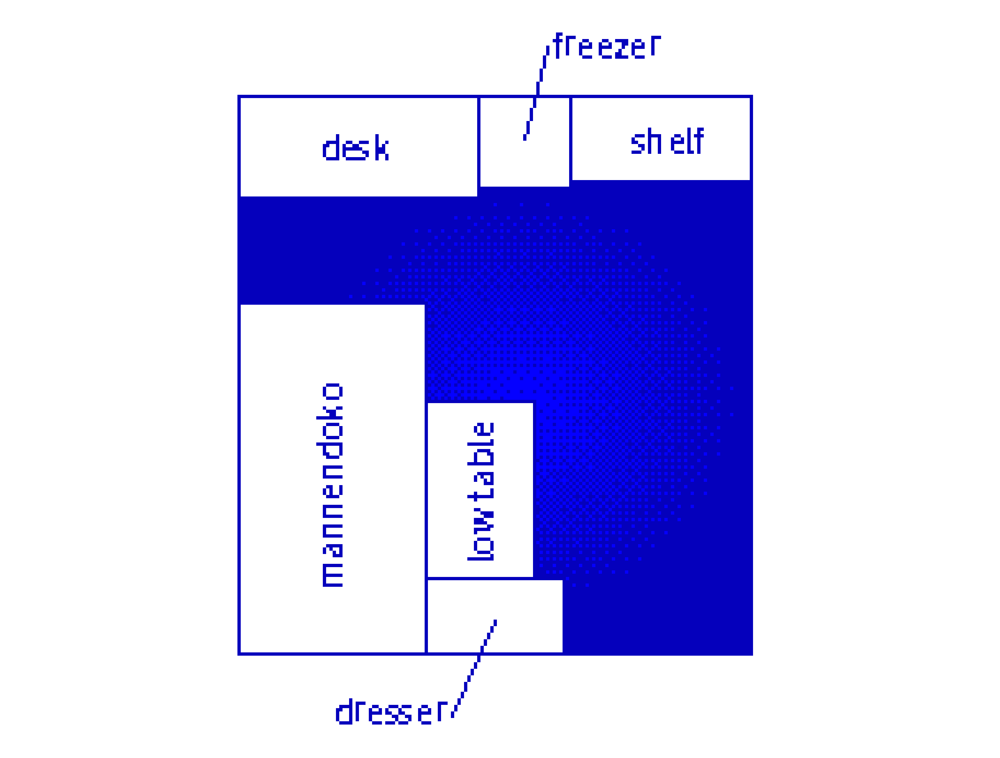

今日やったことといえば、本当にブログの整備をした、ぐらいでヤバい

いや、多分この全く無意味な謎の焦りみたいなのが一番ヤバいのだと思う

部屋がこういう間取りなんですけど、音の出る機械が隣に2台あるんですよね。

- 冷蔵庫（ｻﾞｰｰｰｰｰｰｰｰｰｰｰｰｰｰ、ｳｨｰｰｰｰｰｰﾝ、ﾁﾘﾁﾘﾁﾘﾁﾘ）
- デスク下のパソコン（ｻｰｰｰｰｰｰｰｰｰｰｰ/ブオオオオオオオオオオオオオオオオオオオオオ！！！！）

これって狂う人は狂うのではないか

なんか昨日今日は、常に相対性理論とやくしまるえつこをspotifyで流しているのだけれど、それとノイズの音域と違うのでめちゃくちゃ気になってしまう。
普段はもっとオタククラブミュージックみたいなやつだから低音に紛れるのですが

てか、やくしまるえつこ冷蔵庫の音で落ち着くとか言ってるの普通に異常者だろ……

 

騒音で言えば妹がマジのストレス性聴覚過敏みたいなのになってた時があって、そのときは隣の部屋の俺のメンブレンｷｰﾎﾞｰﾄﾞカタカタ（たぶんデシベルでいうと10以下）で毎回彼女は発狂しそうになっていたから気になる人はこんなレベルではなく本当に気になるんだろうな

