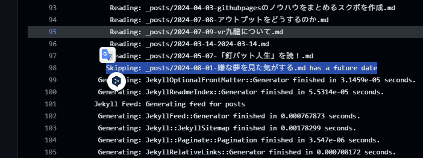

問題はこれだった

ChatGPTにきいたところ（
[Jekyll Future Date Issue](https://chatgpt.com/share/def37309-04cb-427c-a80b-af184c5dfe06)）

Jekyll の設定ファイル _config.yml に`future: true`と追加することで、未来の日付の投稿もビルドに含めることができるそうなので

した

解決した
