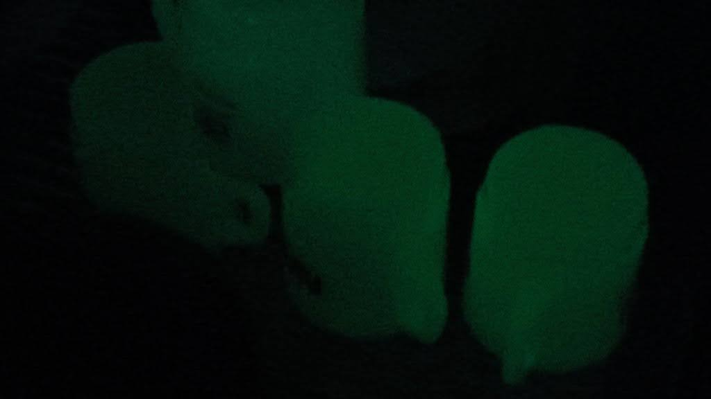

**下北沢はカスの町である。**
まず、第一に全てが気に食わない。  
第二はない。
これで言うべきことは全て言った。つまり、私はあの町に対して偏見を持っており、偏見のみを持っている。

---

僕はたまに高校来の友人（今は学生をやっている）と遠征して、ちょっと遠い二郎系ラーメンを食べに行くということをしている。
この夏はラーメン二郎相模大野店へ行った（うまかった）。その帰り道、彼が下北沢で古着を見たいと言ったので、まぁ道中だしいいかと了承し、移動を開始した。

京王井の頭線で吊革につかまりながら彼は、最近は丁寧な暮らしをしているんだ、と僕に言った。
これはマジであり得ないことである。
彼が丁寧な暮らしをすることの在り得なさを補足する。

彼は高校の頃、端的に言って発狂していた。  
正確には、思春期においてドーパミン異常ですべての人間が発狂している。が、その中でも飛び抜けて彼は狂っていた。
例えば、我々の通っていた学校は寮があり、毎朝点呼があった。上級生下級生問わず謎の制度と爆音のチャイムにたたき起こされて、クソ不機嫌になりながら、クソクソ寒い玄関前に集合する必要が毎朝あった。
そのこれ以上ないほど不機嫌な人間でごった返す廊下で、すれ違う人すべてにクソクソクソ大きな声で「おはようございます！今日も一日頑張ろう！」と叫んでいた。
結果、一つ上の代にあいつキモと陰口をたたかれていた。  
彼曰く、挨拶はした方が良いからした、とのことである。

---

話を戻す。

二郎の帰り、京王井の頭線で吊革につかまりながら彼は、最近は丁寧な暮らしをしているんだ、と僕に言った。

そのあともごちゃごちゃ言っていたが、要約するとこうだ：
**俺は過去、ドーパミン過多のせいで異常行動を繰り返していたが、自分の異常性の根源を発見したため、もう異常行動をしなくてよくなった。となると行きつく先は丁寧な暮らしである。**

僕は：
- ドーパミン過多で狂っている人間が好きなので、少し寂しくなった。
- 丁寧な暮らしを毛嫌いしていた人間が急に手のひらをひっくり返してコーヒーを挽き始める事例が身の回りで多く（4件ほど）見られたため、マジなんなんだ、と思った。
- 急に丁寧な暮らしをしようとする人間はガラッと生活を変えようとする（なんかミニマリストになろうとしたり）が、それもまた異常性であり、とんちんかんな方向に進みがちであるよな、と思った。
- 異常性の治療について、たいていこれはトラウマやら育成環境における社会コードとかと結びついていて、弱めることができても完治することはないし、別の芽が出てきたりするよな～と我が身を振り返った。
- 主にそれは私の周りでは、親の経済圏・生活圏から離れることによって急に丁寧な暮らし人（ていねいなくらしびと）が発生することが多いように思った。

まとめとして、僕は「まぁ良いんじゃないか」と言った。

---

そういう話をしながら下北沢駅の改札を通り、古着を見に行った。丁寧に。

しかし、古着屋の多くある通りに向かう途中、道行く人を見て彼は
「下北沢を構成する人間は下北沢にアイデンティティを持っており、自分のアイデンティティを街に依存する人間の割合が高い街は総じてカスである」みたいなことを言った。

僕はそれを聞いて、お前は一生丁寧な暮らしできねぇよと思って安心した。

そして通りについたものの、なんか／やっぱ／いいや、みたいなことを呟きながら、結局一店舗も店に入らず通りを過ぎた。

**補足：** 彼はオタクではないため、私のように単に古着屋に入るのが怖いから入らないみたいな行動原理ではなく、何か別の（恐怖以外の）心理効果が働いたのだと考えられる。

---

僕と彼の関係は共に年に数回ラーメン二郎をめぐる、という口実を目的として辛うじて持続していた。

今のガキは早熟である。根は昔と変わらず、年相応にバカなくせに、変な光る板から変な三行以下の情報を摂取し続けているため、口だけ達者、草食系、趣味がない、挨拶をしない（あるいは過度に挨拶をする）、ドーパミン中毒のバカガキ……といった感じになっている。
我々もそのZ世代の一員であるため、まだ20代も前半のうちから[エリク・H・エリクソン提唱の発達課題](https://web.cortland.edu/andersmd/ERIK/sum.HTML)で言う「親密性と孤独」の問題が各々の人間関係においてクリティカルなものとして発生しており、関係性をむしばんでいる。

端的に言えば、みんな大人になってしまった。  
だから悲しいね、という話をしたかった。

---

古着・ストリートからの帰りに汗だくになりながら、セレクトショップ的なところに入った。

そこで***暗闇で光る***NASAのマグカップを発見した。

NASAという機関はマジでかっこいいから大好きである。ていうか機関ってだけでかっこいいから好きだし、でっかいロケット作ってるし、なんか宇宙？とか行くらしいし、ドナルド・トランプは死ね（[最近ヤツのせいでNASA職員が2割やめた](https://www3.nhk.or.jp/news/html/20250728/k10014876611000.html)）。
しかも暗闇で光る。

僕は熱さで朦朧としていたため、これを4つ買おうとしているが、どう思う？俺は今自分が熱中症にかかりかけていて正常な判断ができていない気がする。と彼に聞いた。
「お前は熱中症ではないがおかしくはあるため、1つにするべきだ」と言われた。

僕は***暗闇で光る***マグカップを1つ買った。  
その後別れて帰宅した。

---

僕はそのはマグカップをマジで気に入っている。
マジで気に入りすぎて、その晩ネットで3つ追加注文した。
下北沢で買うより200円割高なうえに送料もかかったが、NASAだし、なんと４つとも***暗闇で光る***ため、マジで気に入っている。

……なんだこの文章？