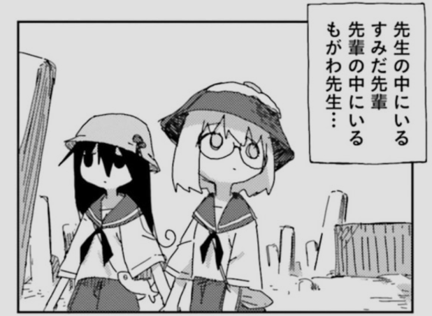

## 最近どう？
友人が愛についてのグループ展をしていたので、自然な流れとして愛について考えるなどした。
まぁ、愛はいかに実践するかだから…………

あと、愛についてObsidianのファイルを漁ると3年前にいろいろ考えていたのが発掘されて良かった。
当時は、また別の友人の影響で愛するということ（エーリヒ・フロム）を読んでいて、
以下のように解釈していた。

- （フロム曰く、）愛とは確固たる個を持つことである
    - つまり、能動的に他者に与えることにより、自分の持てる力を表現することである
    - 表現したことにより、自分の力を実感する（自分の存在を実感する）ことである
    - 他者をそのための媒体として信用することである
        - 他者を信用できない（配慮、責任、尊重を失って道具として扱う）と孤独になる

フロムはあくまで人間は個であるから究極的には孤独であって（完全にわかりあうことは不可能）、そのうえでそれを修正していく方法論・技術としての愛を語ろうとしていたから結構好感を持っていた気がする。
あと冷静にイカれたジジイが「愛は技術だ！」とか言って本まで出してるの面白すぎるってのもある。

今も7割くらい正しいと思ってるし。
今の人格を作る礎にはなっているよな。

## コンテキスト
コンテキストコンテキストって最近ずっと言ってるのでClaudeとにまとめる（普通に書いてて頭こんがらがってきたので）。
で、加筆修正したのが以下。要約付き。
やっぱ残しておくことって大事だし、アウトプットして初めて内的にも外的にも批評の対象になるため大事と思った。

### まず
まず①：人間が他者を認識するとき、それって純粋な知覚ではない。過去の積み重ねによって構築された神経回路が発火して、相手を解釈する。クオリアとしての他者ではなく、物語としての他者がある。認識とはつまり、コンテキストを通じた評価である。

まず②：コンテキストとは、ある対象を語るうえで参照される情報の総体——過去の経験、記憶、関係の履歴、すべてを含む。そしてそれは静的な参照先ではなく、新しい情報が入るたびに書き換わる、動的なものである。

---

*多分70%ぐらいあってる要約：*

Pasted image 20260313002619.png
*つくみず「シメジ シミュレーション」5巻より*
### そもそも
そもそも①：ここで言う他者の「変化」とは、客観的・絶対的な人格の変容ではない。自分の中にある他者像が更新されること——知らなかった側面が現れる、想定外の行動をとられる、これまでの像と矛盾する何かが露出する——そういった事態を指す（これも不条理の一種）。
これは劇的になりうる。長年の像が一瞬で崩れる。そのとき人は、自分の中の他者像が根拠のない構築物だったことを突きつけられる。
コンテキストを増やすことは、この崩壊への抵抗となる。相手について広く、多角的に知ることで、像を複雑にする。像が複雑であるほど、想定外の側面が現れたとき、それを「この人にあり得ること」として吸収できる。像の更新が、破綻ではなく拡張になる。

そもそも②：他者と完全にわかりあうことは不可能である（実はニュータイプ概念ってフィクション）。ポスト構造主義的に言うと言語に変換する時点で内的状態はこぼれ落ち、同じ言葉でも処理するコンテキストが互いに異なる。送受信の間には、原理的に濁りが発生する。
だから相互理解は完成しない。誤解を削り続けるプロセス自体が相互理解とも呼べる。その試行の蓄積こそが、コンテキストの実体である説がある。

そもそも③：コンテキストが双方向に積まれたとき、初めて関係性が発生。これは因果の順番として重要で、長期的な関係があるからコンテキストが積まれるのではなく、コンテキストが積まれるから初めて、長期的な関係を互いに意識できるようになる。
関係性とは、互いのコンテキストが接続された状態である。片方だけがコンテキストを保持している状態——一方的な執着とか、あるいは記憶の喪失——では、関係性の意識は共有されない。関係性として成立するためには、コンテキストの保持が双方向である必要がある。

---
*多分80%ぐらいあってる要約：*

*こかむも「クロシオカレント」3巻より*

*これは要約じゃないんだけど100%これを言いたいのでこれを読めば全てが判る：*
*カズオ・イシグロ「わたしを離さないで」本編*

### それで、何？
それで、何？①：互いのコンテキストが接続されて生まれた関係性は、代替不可能になる。
その関係においてしか生まれない情報がある。像が更新された履歴、誤解とその修正の記録、像の崩壊と再構築の経緯——それらは別の関係で再現できない。コンテキストは、その二者の間にしか存在しない固有の（ユニークな）構造物？だ。
逆に、コンテキストのない関係は代替可能だ。同じ機能を持つ人間は他にいる。だから愛は社会によって、介護のように福祉化できない。愛の本質は機能ではなく、その関係においてのみ存在する蓄積にあるため。

それで、何？②：代替不可能性の構造的なリスク
ただし、代替不可能性は価値であると同時に、リスクでもある。一つの関係へのコンテキストの集中は、依存を生む。代替不可能であるがゆえに、手放せなくなる。
人間関係は構造的に、このリスクを内包している。一つの関係が代替不可能になるほど、その喪失は致命的になる。だから人間関係は自然に、複数の軸で成立するようにできている。複数の関係にコンテキストを積むことで、喪失への耐性が生まれる。これは処方箋ではなく、人間関係が持つ構造的な性質だ。

---

*60%ぐらいあっている要約：*
*「あなたはゴーレムになっちゃ駄目なんだ。じゃなければ」とグラールは無意識的に虚空へ向けて呪文のように唱えている。「わたしたちだって動死体のままだっていうことになる」*
*円城塔「土人形と動死体」より*

*誤解を与えそうで怖いが、90%くらい近いことを言いたい気がする：*
*「アヤナミは綾波だよ。」*
*シン・エヴァンゲリオン劇場版より*

### 結局？
結局？：自分の中の他者像は、つねに更新され、ときに劇的に崩れる。コンテキストを積み重ねることが、その崩壊への唯一の抵抗となりうる。そのコンテキストが双方向に接続されたとき、関係性が生まれる。そしてその蓄積が、関係を代替不可能なものにする。
代替不可能性は、人間関係において他のいかなる概念にも還元されない。同時に、先に述べたようなリスクでもある。その両方を引き受けることが、可変で固定できない他者と関わり続けることの実態と言えるのではないか。

---

*50%くらいの言いたいこと：*
<iframe data-testid="embed-iframe" style="border-radius:12px" src="https://open.spotify.com/embed/track/4soSnJLiFTmaMRrJWri3EB?utm_source=generator" width="100%" height="152" frameBorder="0" allowfullscreen="" allow="autoplay; clipboard-write; encrypted-media; fullscreen; picture-in-picture" loading="lazy"></iframe>

以上、最近よく言ってる気がする「人間関係はコンテキスト」の内容です。

## 花粉か散歩か
バーガーキングが安くなってるというので友人と食いに行った。30分待ちかつ店内の椅子がすべて埋まっていたため、待ち時間に散歩をした。
最近、花粉がヤバい以外は散歩に非常に適している気候になってきたのでとてもいいこと。
花粉なんて屋内にいてもダメージあるのだから、屋外の散歩の楽しさで紛らわせた方が良いに決まってる。
やはり春が最も良い。

同タイミングで新卒として入社した同期はまぁまぁな人数いたのに、一年が経とうとしている今誰もやめてなくて、俺たちはよくやってるよ、と話すなど。

BBQバーガーみたいなやつ、うまかったです。

## SexyCrab
[🦀　🦀　🦀　🦀](https://youtu.be/Qk5YzFnXnds?si=Ana1ut9l7dJd-dzJ)
皆さん、エッチガニは見ましたか？
エッチガニは見た方が良いですよ。

## 春が始まる
希望ですね。
希望の季節だ。
嬉しい
