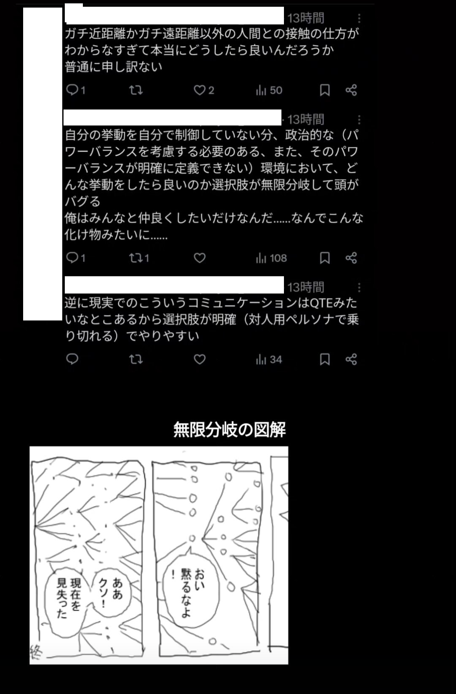

## 最近どう？
会社で引っ越し（フロア移動）が行われたり、考課目標を書いてねみたいな事象が起こったりしてる。
まぁ、期末だから？

考課目標というシステムに対してやるせなさを覚え、でも俺の部署は引っ越ししなくていいらしいのでほっとするなど。
俺は今の席位置が気に入っているので。

フロア移動用の引越しサービスがあることを初めて知って、段ボールごとに管理番号が振られているところが面白いと思った。複雑な移動があるのでロストするっぽいんだけど、これを控えておくことでローラー探索が可能。
あと、オフィスのありとあらゆるところが養生されているのも良かった。
もちろん段ボールのサイズは1種類だけ。
そう思うと、労働に比べて一般的な生活って複雑すぎるな。

## 滝
さらに、三連休だったので旅行に行った！
俺は十分瀑布（台湾の滝。ナイアガラの滝みたいな見た目してる）を見てから滝観が変わっていて、
今回の旅でもそれがさらに更新されて良かった。
滝を3つ見て、1つ作ったんだけど、滝にも地域性があることと、滝が形成される要件分析の必要性と、横から見るか、下からみるかみたいな観測者のセッティングによって全く違う顔を見せる、ということを学んだ。

## 書こうとしてやめたものの断片

そう思うとここ1年、ある程度顔を見知った身内（ライフ）と、それなりに社会性仮面をつけた社会（ワーク）としか関わっていなくて、
その中間領域に人間が存在することを忘れていたのかもしれない。

俺はやっぱその中間領域について考えて行動する事に謎のトラウマがある。
うーん、よくわからない
多分、少年期までの育成環境において他者の目を常に強く意識させられていたことがその原因な気がするんだけど。

よくわからないが関連する過去のツイートをスクショして画像を添付してストーリーに投稿したもの発見したので諸々の情報を消して貼っておく。
画像についての著作権は@sui3ho9にあります。この件に関して俺は確固たる意志をもって無断転載をする。

