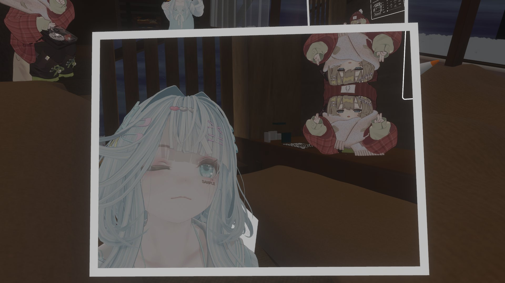

## 最近どう？
てんやわんやしているのが常となってきたので、もはやこれと言って感想がない。ただただ私が悪い。

病院、3回予約変更した上、まだいけてなくてごめん……
漫画、全然手を付けられてなくてごめん……
洗濯物、溜めちゃっててごめん……

ほんとうにごめん
俺はもうだめかも知れない

## 肉体から解き放たれてほんとうにうれしい
友人がVRChatに本格参入したので[夜の街を225km/hでドライブして40回くらい事故った](https://vrchat.com/home/launch?worldId=wrld_f7a25364-c6a5-4b12-af64-c67bd95ef960)。
「肉体から解き放たれてほんとうにうれしい」とは友人の言。

相手の見た目が変わることで特にコミュニケーションにこれまでと違いはないのだけど（そもそも陰キャなのでリアルでもバーチャルでも相手をがっつり視界に入れながら会話することはない）、
相手の見た目が良いということは、それを肯定したほうが良いのか？みたいな謎の逡巡を生み、実際可愛いと私のクオリアが言っているのでその辺むずいと思った。

*奥が私*
## てか
> そもそも陰キャなのでリアルでもバーチャルでも相手をがっつり視界に入れながら会話することはない

ってさっき書いたけど冷静に陽キャでも相手を凝視しながら会話することはないよな……多分？
なんかアンチルッキズムなので他者の外見に関して言及すること全てに罪悪感を感じている側面はある。
よく言うことも、悪く言うことも
私は相対主義者だから……
でも、多分解像度が荒いだけで、相手の可変な部分（装飾品とか）に関して言及することは、必ずしも悪くないんだろうな？と思う。
自分が可愛くなることは嬉しいわけだし。

てことは、究極、VRCはすべての要素が可変なのですべて言及して良いのか。
現実に関しては美容整形技術と、周辺の倫理があと4,5個のブレイクスルーを経なきゃいけない。

## 風邪を引いてたんですけど
マジで治り悪くなっててビビった。
なんかそういうもんだっけ？
1~3日目：しっかり体調が悪く、悪寒頭痛異常な色の鼻水など一通りの症状がローテーションで発生。
4~6日目：常にうっすら体調が悪く、もういっそこれがデフォルトのような気がしてくる。

これが加齢なら、確かに若くて免疫力が高いことは良いことであるなと思った。
